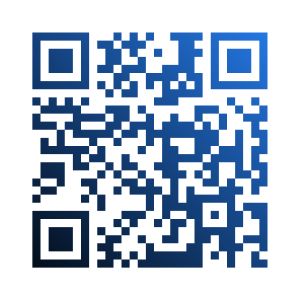
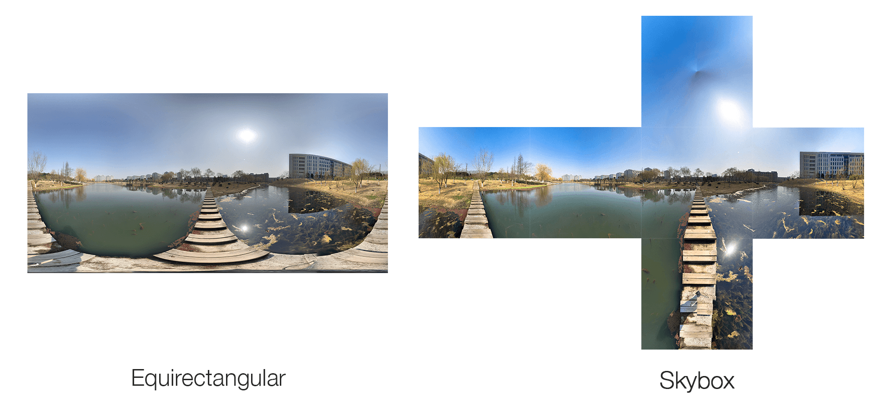

# vue-pano

基于 WebGL 的全景漫游 vue 组件，支持移动设备。


扫描如下二维码或访问 [https://chichou.github.io/vue-pano/](https://chichou.github.io/vue-pano/) 查看演示。



## 全景图片拍摄和准备

全景图片可使用三脚架固定的相机拍摄，然后经过 [Microsoft ICE](http://research.microsoft.com/en-us/um/redmond/projects/ice/) 或  等工具进行拼接等后期处理。此外 Google 的 [PhotoSphere](https://www.google.com/streetview/apps/) 应用可以使用 Android 或 iPhone 手机拍摄全景照片并导出，但在室内使用拼图效果可能不理想。



vue-pano 使用立方体投影的纹理。如果您的图片素材是 equirectangular 的投影，那么需要使用 PtGui 等工具进行转换。或使用我的另一个工具 。纹理图片在不同方向一共有 6 张，可参考 `example/assets/pano` 目录下的示例。

## vue 组件

库仅导出了一个 Pano 组件。

`import Pano from 'vue-pano'`

### 属性

支持的属性有：

* width, height：宽度和高度
* title: 全景图标题
* bundle：全景图纹理路径
* format：全景图图片扩展名
* debug：调试模式

### 代码示例

```javascript
<script>
import Pano from 'vue-pano'
...

export default {
  components: { Pano }
}
</script>
<template>
  <pano title="茶水间" width="720" height="480" bundle="example/assets/pano/pantry/" format="jpg"></pano>
</template>
```

## TODO

- [ ] 将 bundle 改为 json，单独定义六面的 url
- [ ] 渐进式载入
- [ ] 图片进度条

## 许可

MIT

