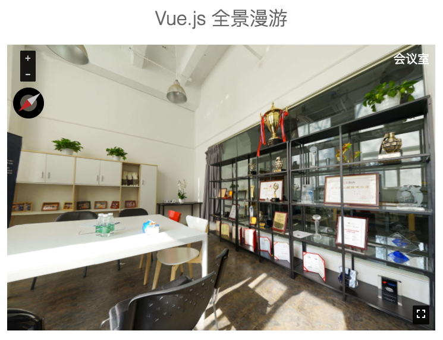

# vue-pano

WebGL panorama component for vue.js



Click this link or scan the QRCode on your mobile devices to see the demo:

https://chichou.github.io/vue-pano/


## Usage

You can use [PhotoSphere App from Google](https://www.google.com/streetview/apps/) to take a panorama. Since it results in a skysphere image, and the vue-pano only supports the skybox format, you need to convert the image using this tiny tool [glskybox](https://github.com/ChiChou/glskybox).


Directly require `src/Pano.vue` will be fine, but you can also place a panorama view with a simple html tag:

```javascript
<pano title="长亭科技前台" width="720" height="480" bundle="assets/pano/reception/" format="jpg"></pano>
<pano title="茶水间" width="720" height="480" bundle="assets/pano/pantry/" format="jpg"></pano>
```


## Build Setup

``` bash
# install dependencies
yarn

# serve with hot reload at localhost:8080
yarn run dev

# build for production with minification
yarn run build
```

## License

MIT